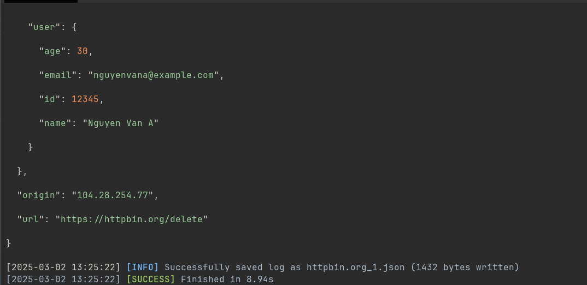

# Kiew. A Rust Command Line Tool for Website Scraping

**This project is licensed under the [MIT LICENSE](LICENSE)**

## Table of contents
- [Features](#features)
- [Quick Start](#quick-start)
- [Build Requirements](#build-requirements)

## Features
**API Testing:**
- Support `PUT` `POST` `DELETE` `GET` request
- Customize header
- Customize payload with JSON format
- Support logging system
- Friendly, with `progress bar`, `color_highlight`, `time benchmark`

    

**Web Scraping:**
* Update Soon

## Quick Start:
### Installation:
#### Source installation:
> **Note: Please read our requirements to build at [Build Requirements](#build-requirements)**

```bash
git clone https://github.com/Reim-developer/kiew.git
cd kiew
cargo build --release --verbose
cd target/release/ && kiew --help
```

- Binary Installation:
- Install at [release page](https://github.com/Reim-developer/kiew/releases)

### Build Requirements:
- `Git ≥ 2.39.5`
- `Rustup ≥ 1.27.1`
- `Rustc ≥ 1.84.1`
- `Cargo ≥ 1.84.1`

### Sample:

#### API TEST:
**`POST` method**
```bash
kiew post -w "https://httpbin.org/post" -H "User-Agent: KiewCLI" -H "Accept: application/json" -P '{"user":{"id":12345,"name":"Nguyen Van A","email":"nguyenvana@example.com","age":30},"order":{"order_id":"ABC123XYZ","items":[{"product":"Laptop Dell XPS 13","price":1500.99,"quantity":1},{"product":"Mouse Logitech MX Master","price":99.50,"quantity":2}],"total":1699.99,"status":"pending"},"timestamp":"2025-03-01T12:34:56Z","metadata":{"source":"web","campaign":"spring_sale_2025"}}'
```

**`PUT` method**
```bash
kiew put -w "https://httpbin.org/put" -H "User-Agent: KiewCLI" -H "Accept: application/json" -P '{"user":{"id":12345,"name":"Nguyen Van A","email":"nguyenvana@example.com","age":30},"order":{"order_id":"ABC123XYZ","items":[{"product":"Laptop Dell XPS 13","price":1500.99,"quantity":1},{"product":"Mouse Logitech MX Master","price":99.50,"quantity":2}],"total":1699.99,"status":"pending"},"timestamp":"2025-03-01T12:34:56Z","metadata":{"source":"web","campaign":"spring_sale_2025"}}'
```

**`DELETE` method**
```bash
kiew delete -w "https://httpbin.org/put" -H "User-Agent: KiewCLI" -H "Accept: application/json" -P '{"user":{"id":12345,"name":"Nguyen Van A","email":"nguyenvana@example.com","age":30},"order":{"order_id":"ABC123XYZ","items":[{"product":"Laptop Dell XPS 13","price":1500.99,"quantity":1},{"product":"Mouse Logitech MX Master","price":99.50,"quantity":2}],"total":1699.99,"status":"pending"},"timestamp":"2025-03-01T12:34:56Z","metadata":{"source":"web","campaign":"spring_sale_2025"}}'
```